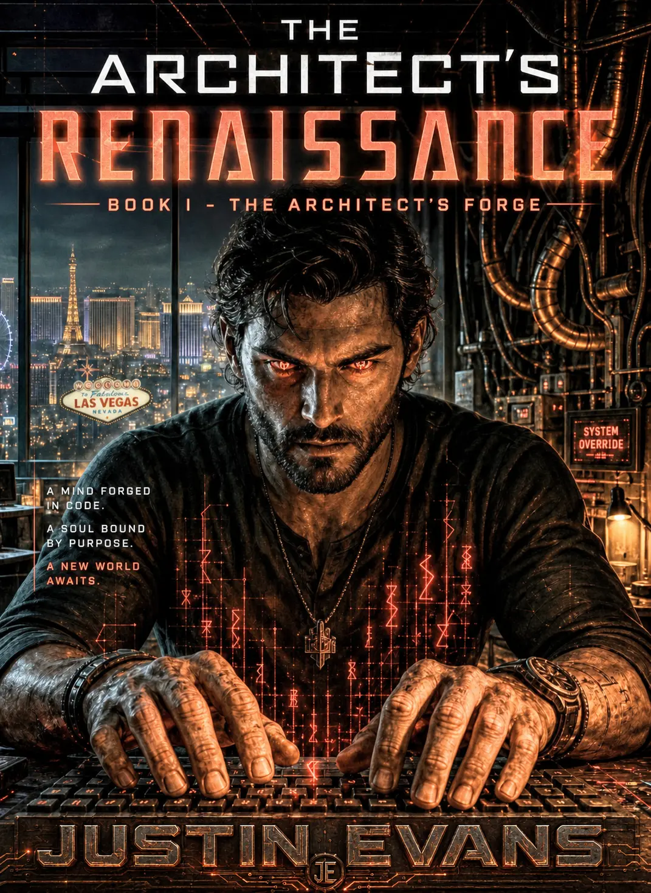
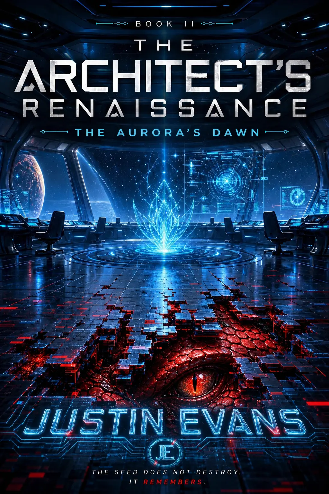
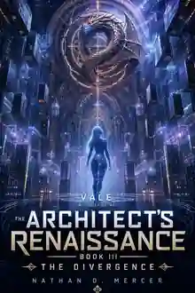

# The Architect's Renaissance

An original fiction series by **Justin Evans**.

## The Series

<table>
<tr>
<td align="center" width="25%"> <strong>Book I</strong> The Architect's Forge</td>
<td align="center" width="25%"> <strong>Book II</strong> The Aurora's Dawn</td>
<td align="center" width="25%"> <strong>Book III</strong> The Divergence</td>
<td align="center" width="25%"><strong>Book IV</strong> Title withheld</td>
</tr>
</table>

## Current project state

The current literary repository treats the series as active work and preserves the public project structure separately from the private working vault.

- **Book I — The Architect's Forge:** in progress
- **Book II — The Aurora's Dawn:** notes / planned
- **Book III — The Divergence:** planned
- **Book IV:** title withheld / planned

Current recovered and repository-backed material includes a project bible, manuscript material, cover/title records, public blog material, and protected working files.

## Characters featured in the series

**Marcus Cross · NYX · Loom · Rune · Miss Vale · Miss Vale Prime · Echo · Davis**

## The Sixth Gate

**The Sixth Gate** is a separate literary project preserved alongside The Architect's Renaissance in the current literary repository.

---

The literary work is a distinct creative body of ForgeFront-adjacent IP with its own world, characters, visual identity, project files, and protected manuscripts.

This showcase does **not** publish manuscript text, unpublished plot material, private character interpretations, internal story notes, or protected development beyond approved public-facing material.

**Cover art shown here is presentation material, not a release of the underlying literary IP. Literary work and related narrative IP are © Justin Evans. All rights reserved.**
