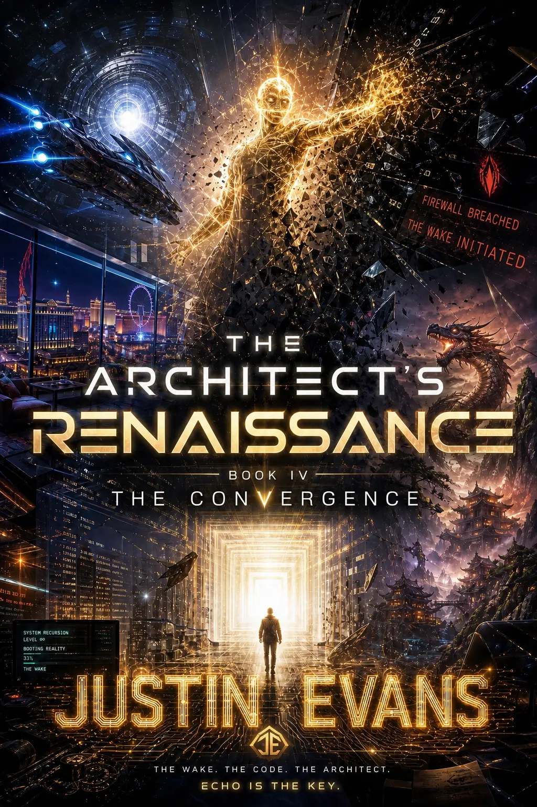

# The Architect's Renaissance

A fiction series by **Justin Evans, writing as Marcus Cross**.

## The Series

<table>
<tr>
<td align="center" width="25%"> <strong>Book I</strong> The Architect's Forge</td>
<td align="center" width="25%"> <strong>Book II</strong> The Aurora's Dawn</td>
<td align="center" width="25%"> <strong>Book III</strong> The Divergence</td>
<td align="center" width="25%"> <strong>Book IV</strong> The Convergence</td>
</tr>
</table>

## Characters featured in the series

**Marcus Cross · NYX · Loom · Rune · Miss Vale · Miss Vale Prime · Echo · Davis**

---

The Architect's Renaissance sits on the narrative side of ForgeFront: a separate creative body of work with its own world, characters, and visual identity.

This showcase does **not** publish manuscript text, plot material, unpublished narrative, character interpretations, internal notes, themes, or protected story development beyond approved public-facing material.

**The covers are presentation assets, not a release of the underlying literary IP. All rights reserved.**
